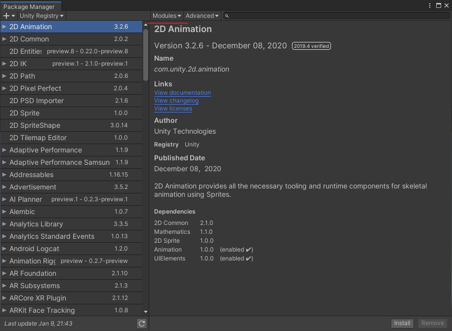
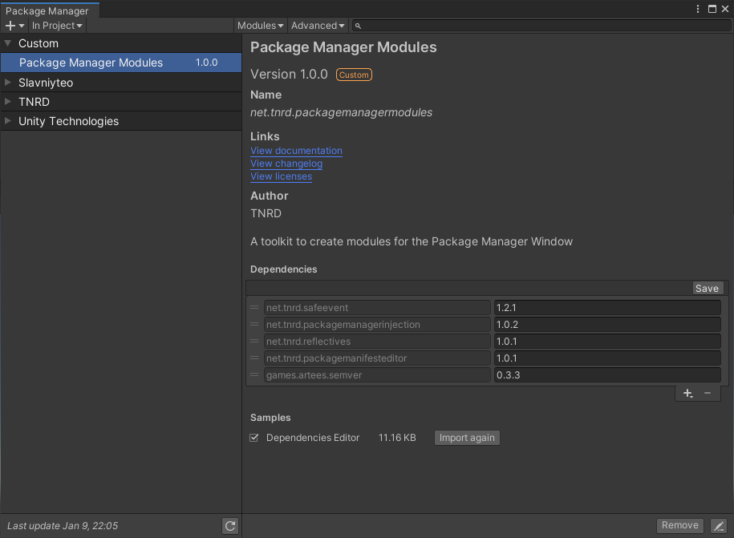

# Package Manager Modules

<p align="center">
	
	<a href="https://github.com/Thundernerd/Unity3D-PackageManagerModules/issues">
		
	</a>
	<a href="https://github.com/Thundernerd/Unity3D-PackageManagerModules/pulls">
		
	</a>
	<a href="https://github.com/Thundernerd/Unity3D-PackageManagerModules/blob/master/LICENSE.md">
		
	</a>
	
</p>

A toolkit to create modules for the Package Manager Window.

## Installation
1. The package is available on the [openupm registry](https://openupm.com). You can install it via [openupm-cli](https://github.com/openupm/openupm-cli).
```
openupm add net.tnrd.packagemanagermodules
```
2. Installing through a [Unity Package](http://package-installer.glitch.me/v1/installer/package.openupm.com/net.tnrd.packagemanagermodules?registry=https://package.openupm.com) created by the [Package Installer Creator](https://package-installer.glitch.me) from [Needle](https://needle.tools)

[](http://package-installer.glitch.me/v1/installer/package.openupm.com/net.tnrd.packagemanagermodules?registry=https://package.openupm.com)

## Usage

### Creating a module

To create a module you need create a class that implements the `IPackageManagerModule` interface.

These classes get automatically picked up and added to the module menu which can be located at the top of the Package Manager Window




### Identifier
The identifier of your module should be unique and only be used for one package. I recommend using the [reverse domain name notation](en.wikipedia.org/wiki/Reverse_domain_name_notation) for this.

### DisplayName
The display name of your module is what will be shown in the modules menu. If you plan on creating multiple modules then you can group them together by using a / (forward slash)

e.g. `Foo/Bar`, `Foo/Baz`, `Foo/Qux`

These will all be grouped together under `Foo`

### IsEnabled
This is to identify if your module is enabled. You have to keep track of this yourself in your module. This will be reflected in the modules menu.

### Initialize()
This is called when the modules are created and should be used for initialization logic only.

### Dispose()
This is called when the Package Manager Window closes or when the editor starts recompiling. Use this to clean up things like event subscriptions.

### Enable()
This is called when the user enables your module through the modules menu.

### Disable()
This is called when the user disables your module through the modules menu. This will also be called when the Package Manager Window closes, or when the editor starts recompiling.

## Sample
This package comes with a Dependencies Editor sample. This sample allows easy editing of the dependencies of a package that is in development. You can import the sample through the Package Manager Window.



## Support
**Package Manager Modules** is a small and open-source utility that I hope helps other people. It is by no means necessary but if you feel generous you can support me by donating.

[](https://ko-fi.com/J3J11GEYY)

## Contributing
Pull requests are welcomed. Please feel free to fix any issues you find, or add new features.
